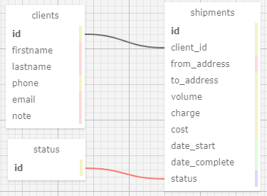
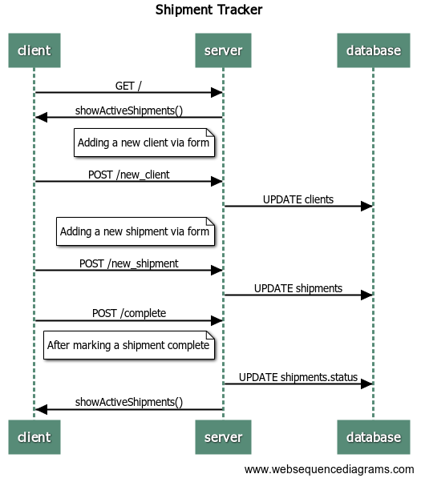

# Shipment Tracker

## Dependencies

### Client

* React
* Webpack
* Babel

### Server

* Express
* mySQL

## Functionality

> ### Planned Functionality
>
> * Dashboard: show active shipments (GET)
> * Dashboard: show last 5 completed shipments (GET)
> * New client form (POST)
> * New shipment form (POST)
> * Click to mark shipment complete (POST)
>
> ### Non-MVP Functionalities
>
> * Edit client information
> * Delete shipment (if duplicate by accident)
> * Delete client (if mistake made)
> * Pages to check all shipment and all clients
> * Track shipment mileage
> * Allow data export to CSV or spreadsheet
> * Show graphs for monthly charges and costs

## Initial Planning

### Table Schemas

### Web Sequence

